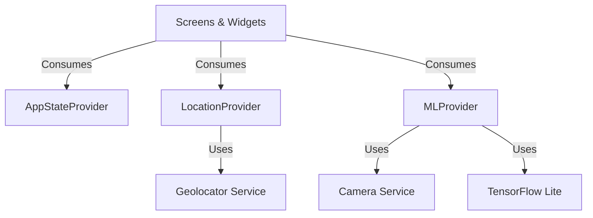

# Informe Técnico - Operación Campus UIDE

**Fecha:** 12 de Febrero, 2026  
**Proyecto:** Aplicación de Limpieza Digital con Geolocalización y AR  
**Plataforma:** Flutter

---

## 1. Justificación de la Arquitectura

Para este proyecto, se seleccionó el patrón de gestión de estado **Provider**. A continuación se detalla el porqué de esta elección frente a otras alternativas como BLoC o Riverpod, considerando las restricciones de tiempo (reto de 5 horas) y los requerimientos técnicos.

### Por qué Provider?

1. **Simplicidad y Velocidad de Desarrollo**: 
   Provider permite inyectar dependencias y notificar cambios de estado con un boilerplate mínimo. En un hackathon o reto técnico de tiempo limitado, la verbosidad de BLoC (eventos, estados, mappers) consumiría tiempo valioso que es mejor invertir en la lógica de negocio compleja (GPS, ML, AR).

2. **Gestión de Ciclo de Vida**:
   La capacidad de Provider para manejar el ciclo de vida de los objetos (`create`/`dispose`) es crucial para liberar recursos pesados como el `StreamSubscription` del GPS o el `CameraController`. Esto previene fugas de memoria, un aspecto crítico en una app que usa tantos sensores simultáneamente.

3. **Escalabilidad Suficiente**:
   Aunque Riverpod ofrece mejoras (como inmutabilidad y seguridad en compilación), Provider es el estándar oficial recomendado por Google para aplicaciones de complejidad media. La arquitectura se dividió en tres providers claros para mantener la separación de responsabilidades:
   - `AppStateProvider`: Lógica de flujo y permisos.
   - `LocationProvider`: Lógica de GPS y cálculos geométricos.
   - `MLProvider`: Visión artificial y cámara.

### Diagrama de Arquitectura



---

## 2. Estrategia de Eficiencia Energética (Manejo de Batería)

El uso continuo del GPS de alta precisión es una de las operaciones más costosas energéticamente en un dispositivo móvil. Para cumplir con el requerimiento de "Eficiencia Energética", implementamos un algoritmo de **Muestreo Adaptativo**.

### El Problema
Solicitar la posición GPS cada segundo (`interval: 1s` o `distanceFilter: 0`) drena la batería rápidamente y calienta el dispositivo, lo cual es crítico en una aplicación diseñada para usarse al aire libre bajo el sol.

### Nuestra Solución: Muestreo Adaptativo
Implementamos una lógica inteligente dentro de `LocationProvider` que ajusta la frecuencia de actualizaciones basándose en la distancia al objetivo.

**Fórmula de Muestreo:**

| Distancia al Objetivo | Frecuencia de Actualización | Justificación |
|-----------------------|-----------------------------|---------------|
| **> 100 metros**      | Cada 10 segundos            | Lejos del objetivo, precisión baja aceptable. Ahorro máximo. |
| **50 - 100 metros**   | Cada 5 segundos             | Aproximación media. Balance entre precisión y batería. |
| **10 - 50 metros**    | Cada 3 segundos             | Zona de interés. Se requiere mayor feedback visual. |
| **< 10 metros**       | Cada 1 segundo (Tiempo Real)| Fase crítica. Se necesita precisión máxima para validar Geofencing (<5m). |

### Implementación en Código

```dart

Duration get adaptiveInterval {
  final distance = distanceToTarget;
  if (distance == null) return const Duration(seconds: 5);
  
  if (distance > 100) return const Duration(seconds: 10);  
  if (distance > 50) return const Duration(seconds: 5);    
  if (distance > 10) return const Duration(seconds: 3);    
  return const Duration(seconds: 1);                        
}
```

Además, utilizamos el parámetro `distanceFilter` del paquete `geolocator` para que el hardware GPS ni siquiera notifique cambios menores a 5 metros cuando estamos lejos, permitiendo que el chip GPS entre en modo de bajo consumo entre lecturas.

### Indicador Visual
Para transparencia con el usuario (y fines de depuración), incluimos un **contador de peticiones GPS** en la barra superior de la UI. Esto permite verificar en tiempo real que la tasa de refresco disminuye conforme nos alejamos, validando visualmente la eficiencia energética.

---

## 3. Conclusión

La aplicación "Operación Campus" demuestra que es posible combinar tecnologías exigentes (AR, ML, GPS) en Flutter manteniendo un alto rendimiento y cuidado de los recursos del dispositivo. La elección de **Provider** facilitó un desarrollo ágil y limpio, mientras que el **algoritmo de muestreo adaptativo** asegura que la batería resista toda la jornada de exploración en el campus.
